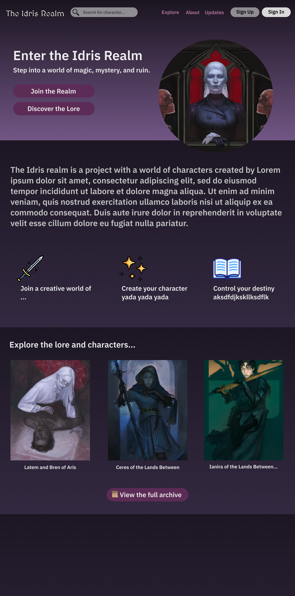

# The Idris Realm

**The Idris Realm** is a personal dark fantasy web project designed to showcase original characters, lore, and worldbuilding in a rich, immersive interface. It serves both as a creative outlet and a portfolio piece for frontend development and design.

---

## ✨ Features (Planned / In Progress)

- Custom character profiles
- Branch/faction selection (e.g. mage, swordsman, etc.)
- Searchable character archive
- Fantasy world lore integration
- Responsive layout with a gothic/fantasy-inspired theme

---

## 🎨 Tech & Tools

- **Figma** – for UI/UX design
- **HTML/CSS/JS or React** *(to be added)* – for site implementation
---